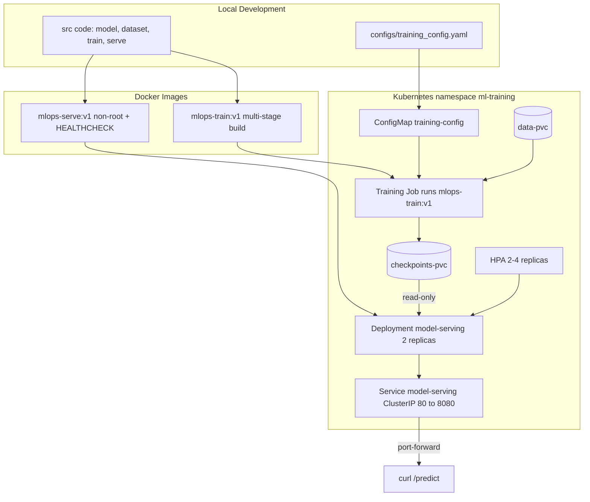

# mlops-pytorch-pipeline

An end-to-end MLOps deployment pipeline that takes a PyTorch image classifier
(ResNet-18 on CIFAR-10) through the full lifecycle: Git workflow, Docker
containerization, and Kubernetes orchestration (training Job + serving Deployment).

## Architecture

## Project Structure

- src/ — model, dataset, training, and serving code
- configs/ — training configuration (YAML)
- docker/ — Dockerfiles for training and serving images
- k8s/ — Kubernetes manifests (namespace, ConfigMap, PVCs, Job, Deployment, Service, HPA)
- requirements/ — separate pinned dependency lists for training and serving
- tests/ — unit tests

## Prerequisites

- Python 3.11, Docker Desktop, kubectl, kind
- A local Kubernetes cluster via kind

## Setup and Run

### 1. Local (no containers)

    pip install -r requirements/train.txt
    python src/train.py
    python -m uvicorn serve:app --app-dir src --host 127.0.0.1 --port 8080

CIFAR-10 must be present in ./data. If automatic download fails (SSL/proxy),
download cifar-10-python.tar.gz from the official CIFAR site and place it in ./data.

### 2. Docker

    docker build -f docker/Dockerfile.train -t mlops-train:v1 .
    docker run --rm -e SUBSET_SIZE=200 -v "${PWD}\data:/app/data" -v "${PWD}\checkpoints:/app/checkpoints" mlops-train:v1

    docker build -f docker/Dockerfile.serve -t mlops-serve:v1 .
    docker run --rm -p 8080:8080 -v "${PWD}\checkpoints:/app/checkpoints" mlops-serve:v1

### 3. Kubernetes (kind)

    kind create cluster --name mlops
    kind load docker-image mlops-train:v1 --name mlops
    kind load docker-image mlops-serve:v1 --name mlops

    kubectl apply -f k8s/namespace.yaml
    kubectl apply -f k8s/configmap.yaml
    kubectl apply -f k8s/pvc.yaml

    kubectl apply -f k8s/data-loader.yaml
    kubectl cp data/cifar-10-batches-py ml-training/data-loader:/data/cifar-10-batches-py
    kubectl delete pod data-loader -n ml-training

    kubectl apply -f k8s/training-job.yaml
    kubectl logs -f job/training-job -n ml-training

    kubectl apply -f k8s/serving-deployment.yaml
    kubectl apply -f k8s/serving-service.yaml
    kubectl apply -f k8s/hpa.yaml

    kubectl port-forward svc/model-serving 8080:80 -n ml-training
    curl.exe -X POST http://localhost:8080/predict -F "image=@test_image.png"

## Notes

- Images use CPU-only PyTorch to keep them small.
- Training runs support a SUBSET_SIZE env var for fast smoke tests.
- The HPA requires metrics-server for live scaling (not installed in kind by default).
